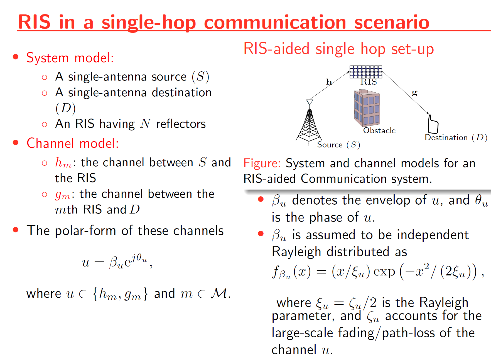
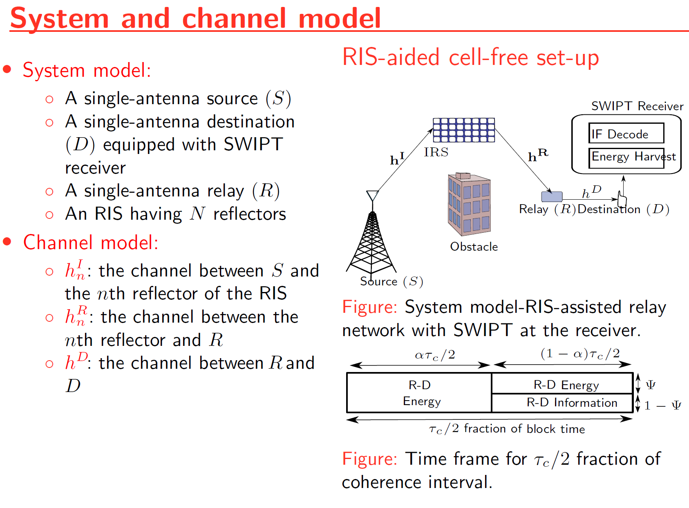
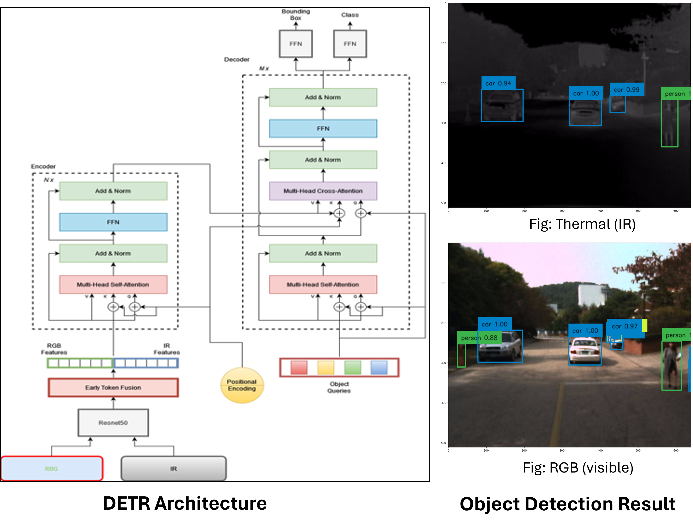
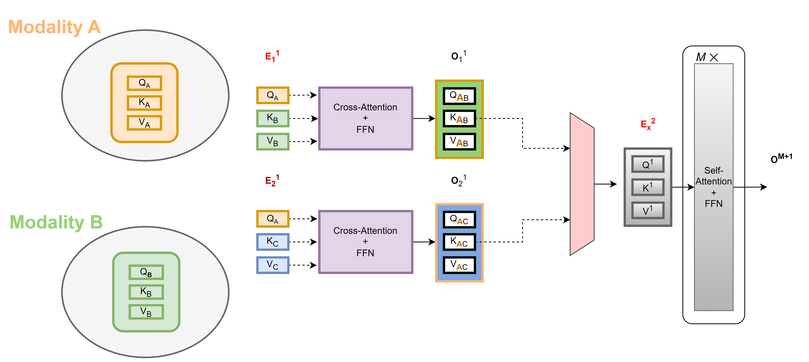
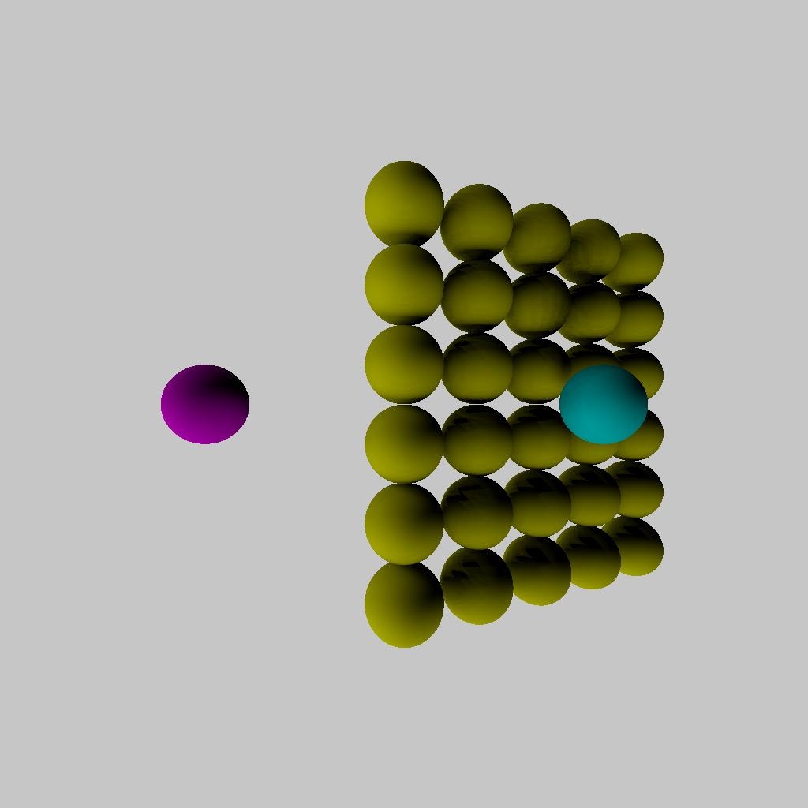

## [**Next Page:** Projects](./another-page.md) | [**My Resume:** Alan](./CV/Alan_Devkota_Resume.pdf)

# **Electrical and Computer Engineer**
- **Software Skills:** Python, C, C++, MATLAB, Core Java and Web Basics
- **Scripting:** MATLAB, Python
- **Neural Network Frameworks:** PyTorch, Keras
- **Libraries:** numpy, pandas, Matplotlib
- **HDL, Synthesis and Verification:** Verilog RTL, SystemVerilog, VHDL, Synopsys VCS, Xilinx Vivado
- **Version Control:** Git
- **Developer Tools:** Visual Studio Code, Jupyter Notebook, Anaconda
- **Other Skills:** Linux, Windows, LaTeX, Office Suite, Statistics

# Education
- Ph.D., ECE | University of Houston | (_Present_)								       		
- M.S., ECE | Southern Illinois University | (_May 2022_)	 			        		
- B.S., ECE | Tribhuvan University | (_Sept 2017_)

# Work Experience
**Graduate Research Assistant @ Efficient Computer Systems (ECOMS) Lab, University of Houston (_Aug 2022 - Present_)**
- Transformer Neural Networks Attack and Defense, Multimodal Neural Networks, Convolutional Neural Network, Object Detection Transformers, Vision Transformers, Machine learning and AI, Computer Architecture, Computer vision, and Object Detection 
- Adversarial Attack and Defense on Transformer Neural Networks, Patch-Based Attacks on Vision Transformers, Undervolting noise for Adversarial Training

**Graduate Teaching Assistant @ ECE Department, University of Houston (_Spring 2023, Spring 2024_)**
- ECE 5357 Intro to Cybersecurity, grade assignment and reports

**Graduate Teaching Assistant @ ECE Department, University of Houston (_Fall 2023_)**
- ECE 6373 Adv Computer Arch, project on Performance Impact of Basic Cache Configuration Parameters Using SimpleScalar, grade assignment,  and reports

**Technical Student, Network Security @ Office of Information Technology, Southern Illinois University (_Jan 2022 - May 2022_)** (part time)
- Working with various customers, end-users, and vendors to troubleshoot issues pertaining to wired and wireless network access, DHCP, DNS, firewalls, VPN, subnetting, routing, and other network services

**Graduate Research Assistant @ Wireless Communication and Information System Laboratory, Southern Illinois University (_Spring 2021, Summer 2021, Fall 2021, Spring 2022, Summer 2022_)**
- Intelligent Reflecting Surface-Assisted Relay Networks, Simultaneously Transmitting and Reflecting Reconfigurable Intelligent Surface (STAR-RIS), and Simultaneous Wireless Information and Power transfer technology (modeling, simulation, statistical characterization, performance analysis, study of phase-shift quantization, Energy Harvesting, and achievable rate-energy trade-off)

**Graduate Teaching Assistant @ ECE Department, Southern Illinois University (_Spring 2020, Fall 2020_)**
- Electronics ECE-345: Lab instructor, design and simulation of Electronics circuits, grade assignment and reports
- Intro to Biomedical Imaging ECE-467: Lab instructor, image processing, 3D image projection, grade assignment and reports
- Digital Signal Processing ECE-468: Lab instructor, signal processing and analysis, filter design, grade assignment and reports

**Electronics Engineer/ Graduate Researcher @ Datalytics Pvt. Ltd., Kathmandu, Nepal (_Jan 2018 - Jan 2019_)**
- Guiding, and supervising fresh graduate engineers in electrical, optical fiber communication, and telecommunication projects
- Preparing technical reports. Conducting routers, switches, and cable installation projects for wired and wireless networks
- Design and analysis of electrical circuits, PCB fabrication, coding of microcontrollers, system modeling and simulations

# Publications
1. D. L. Galappaththige, A. Devkota and G. Amarasuriya, "On the Performance of IRS-Assisted Relay Systems," 2021 IEEE Global Communications Conference (GLOBECOM), 2021, pp. 01-06, doi: 10.1109/GLOBECOM46510.2021.9685500. [ _Link_](https://doi.org/10.1109/GLOBECOM46510.2021.9685500)
2. Devkota, Alan. Performance Analysis of RIS-Assisted Relay Systems. Southern Illinois University at Carbondale, 2022. [ _Link_](https://www.proquest.com/docview/2744623082?pq-origsite=gscholar&fromopenview=true&sourcetype=Dissertations%20&%20Theses)

## Talks, Seminar, Conference, Presentations and Poster

- On the Performance of IRS-Assisted Relay Systems - 2021 IEEE Global Communications Conference (GLOBECOM) -  [_GLOBECOM21_presentation video_](https://saluki-my.sharepoint.com/:v:/g/personal/alan_devkota_siu_edu/EdIBVGc_q1BHr-8UEgZLWCUBJE-DVo3qc90SJKCcQY2IEA?nav=eyJyZWZlcnJhbEluZm8iOnsicmVmZXJyYWxBcHAiOiJPbmVEcml2ZUZvckJ1c2luZXNzIiwicmVmZXJyYWxBcHBQbGF0Zm9ybSI6IldlYiIsInJlZmVycmFsTW9kZSI6InZpZXciLCJyZWZlcnJhbFZpZXciOiJNeUZpbGVzTGlua0NvcHkifX0&e=Jv29gn), [_Presentation-slides_](./Globecom/IRS_relay_globecom.pdf)
- Energy Harvesting in RIS-Assisted Relay Networks - Master's Thesis, Southern Illinois University Carbondale, Aug 2022 [_Thesis_Presentation-slides_](./EH/Alan_Devkota_presentation.pdf)
- Harnessing Heterogeneous Healthcare Data: An Attention Neural Network Approach, 2023 AI in Health Conference (AIHC), Hosted by the Ken Kennedy Institute at Rice University, Houston, Texas, Oct 2023 [_Poster-Link_](./AIHC/AIHC.pdf)
- Hardware Attacks on CNN and Transformer Neural Networks - ECE Graduate Research Seminar, University of Houston, Spring 2023 [_Presentation-slides-pdf_](./Presentation%20Slides/Alan_Devkota_Feb10_Hardware_Attacks.pdf)
- Multimodal Fusion in Transformer Neural Networks - ECE Graduate Research Seminar, University of Houston, Fall 2023 [_Presentation-slides-pdf_](./Presentation%20Slides/Alan_Devkota_Sept29_Multimodal_Fusion.pdf)
- DOTA: detect and omit weak attentions for scalable transformer acceleration - ECE Graduate Research Seminar, University of Houston, Spring 2024 [_Presentation-slides-pdf_](./Presentation%20Slides/Alan_Devkota_Feb15_DOTA.pdf) or [_Presentation-slides-pdf_](./Presentation%20Slides/Alan_Devkota_Feb15_DOTA_v2.pdf)

# Projects

### Click here for more detail about my projects [Link to my Project](./another-page.md)

### All my Project can also be found in my Github Repositories [Link to my Github Repositories](https://github.com/alandevkota?tab=repositories)

****

## Performance Analysis of IRS-Assisted Relay Systems
<!-- [ Publication ](https://doi.org/10.1109/GLOBECOM46510.2021.9685500) -->

This project investigates the performance of intelligence reflective surface (IRS)-assisted relay systems. To this end, we quantify the optimal signal-to-noise ratio (SNR) attained by smartly controlling the phase-shifts of impinging electromagnetic waves upon an IRS. Thereby, a tightly approximated cumulative distribution function is derived to probabilistically characterize this optimal SNR. Then, we derive tight approximations/bounds for the achievable rate, outage probability, and average symbol error rate. Monte-Carlo simulations are used to validate our performance analysis. We present numerical results to reveal that the IRS-assisted relay system can boost the performance of end-to-end wireless transmissions.

****

## Energy Harvesting in RIS-Assisted Relay Networks
<!-- [ Publication ](https://www.proquest.com/docview/2744623082?pq-origsite=gscholar&fromopenview=true&sourcetype=Dissertations%20&%20Theses) -->

Because radio-frequency (RF) signals can convey both information and energy simultaneously, there has been much research interest in designing novel technologies for simultaneous wireless information and power transmission (SWIPT) and energy harvesting (EH).
First, an RIS-assisted relay system model is proposed to improve the wireless system performance. By characterizing the optimal signal-to-noise ratio (SNR) attained through intelligent phase-shift controlling, the performance of the RIS-assisted relay system is investigated. Then, the performance of simultaneous wireless information and power transfer (SWIPT) is explored for the proposed RIS-assisted relay system. Also, the performance of linear EH models and non-linear EH models are compared via analytical and Monte-Carlo simulation results.

****

## Multispectral Object Detection using DETR with Early Fusion of Tokens

A topic we cover in this experimentation is using Detection Transformers (DETR) as a means to conduct Multispectral Object Detection. Here we are using ResNet50 to extract features of both RGB and thermal images and then provide early token fusion by concatenating the extracted features from ResNe50 together and computing attention between the tokens of RGB and IR modalities to get learned feature representations.

### Architecture

****

## Multimodal Object Detection Transformer with Cross-Attention across Modalities

The focus of this research is to develop a transformer model that integrates the information from different modalities together to enhance the prediction as well as address the challenges posed by missing modalities. 
Our modified DETR transformer encoders extract the features from RGB and IR modality via two parallel ResNet50 backbone and harness the vast potential of heterogeneous data via channel fusion of modalities features (RGB and IR) using two parallel cross-attention encoders unlike the original DETR transformer model.

****

## Harnessing Heterogeneous Healthcare Data: An Attention Neural Network Approach

We develop an attention neural network-based method for fusing heterogeneous healthcare data, emphasizing cross-modality attention transformer blocks for optimal modality integration. Moreover, we also integrate prompt learning to enhance the model's performance with datasets that have missing modalities, preserving the core structure of the model and optimizing computational resources.  

### Example of two modality cross-attention in 1st stage then fusion and self-attention

****
## N-Body Simulation with CPU and CUDA

The N-body problem is used in this project to mimic how particles move across space. The project comprises a Python-based serial implementation and a C++/Cuda-based parallel implementation. A program is generated that simulates gravitational force between n bodies in space, exploiting the massively parallel architecture provided by GPGPUs. This program generates N particle locations over a specified number of timesteps. Moreover, it produces gif plots to visualize the bodies in the simulation similar to stars in the galaxy. The results generated compare the performance of CPU-based implementation and GPU-based implementation.

### Simulation

**Fig: N-body simulation in CPU for N = 100 and timesteps = 150**

**Fig: N-body simulation in CUDA for N = 100 and timesteps = 150**

****

## Performance Impact of Basic Cache Configuration Parameters Using SimpleScalar

This paper investigates the performance impact of several basic cache configuration parameters, such as the L1, L2, and TLB cache size, associativity, and block size using the SimpleScalar ”sim-outorder” model and the SPEC 2000 benchmark suite. The results generated illustrate the relationship between Miss Rate and modifications in cache size, associativity, and block size. The results also reveal the impact of the multilevel cache design as well as the efficacy of the TLB cache in enhancing data locality.

****

## Android-App-Remote-Controlled-Vehicular-Robotic-Arm
Remote controlled system (robot) from self developed android app that constantly performs the task of picking an object and moving it to the desired location (both automatic and manual).

In this project, a vehicular robotic arm is made and controlled by an Android mobile app. The development of this model is through ESP32 along with a mobile phone for controlling the robot. This prototype may be expected to overcome the problems of picking hazardous objects or non-hazardous objects that are far away from the user and where displacement of very heavy objects is needed from one place to another as automation is required in many industries.

### Images

****

## Multi-threaded Ray Tracing

This project implements ray-tracing algorithm that performs direct illumination of spheres.
Here, the C++ codes will take two text files as input, describing a (a) list of spheres and a (b) list of lights. Then, it will output the ray-traced image as a Targa file which is further converted into JPG format using python code. One of the major objective of the project is to decrease the latency via parallelism. I successfully parallelized the codes using the C++ std::thread library.

### Output

### [**Next Page:** Link to my Projects with Detailed Explanations](./another-page.md)