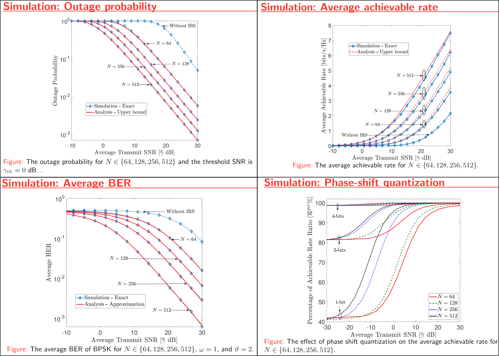

# **Electrical and Computer Engineer**
- **Software Skills:** Python, C, C++, MATLAB, Core Java and Web Basics
- **Scripting:** MATLAB, Python
- **Neural Network Frameworks:** PyTorch, Keras
- **Libraries:** numpy, pandas, Matplotlib
- **HDL, Synthesis and Verification:** Verilog RTL, SystemVerilog, VHDL, Synopsys VCS, Xilinx Vivado
- **Version Control:** Git
- **Developer Tools:** Visual Studio Code, Jupyter Notebook, Anaconda
- **Other Skills:** Linux, Windows, LaTeX, Office Suite, Statistics

# Education
- Ph.D., ECE | University of Houston | (_Present_)								       		
- M.S., ECE | Southern Illinois University | (_May 2022_)	 			        		
- B.S., ECE | Tribhuvan University | (_Sept 2017_)

# Work Experience
**Graduate Research Assistant @ Efficient Computer Systems (ECOMS) Lab, University of Houston (_Aug 2022 - Present_)**
- Transformer Neural Networks Attack and Defense, Multimodal Neural Networks, Convolutional Neural Network, Object Detection Transformers, Vision Transformers, Machine learning and AI, Computer Architecture, Computer vision, and Object Detection 
- Adversarial Attack and Defense on Transformer Neural Networks, Patch-Based Attacks on Vision Transformers, Undervolting noise for Adversarial Training

**Graduate Teaching Assistant @ ECE Department, University of Houston (_Spring 2023, Spring 2024_)**
- ECE 5357 Intro to Cybersecurity, grade assignment and reports

**Graduate Teaching Assistant @ ECE Department, University of Houston (_Fall 2023_)**
- ECE 6373 Adv Computer Arch, project on Performance Impact of Basic Cache Configuration Parameters Using SimpleScalar, grade assignment,  and reports

**Technical Student, Network Security @ Office of Information Technology, Southern Illinois University (_Jan 2022 - May 2022_)** (part time)
- Working with various customers, end-users, and vendors to troubleshoot issues pertaining to wired and wireless network access, DHCP, DNS, firewalls, VPN, subnetting, routing, and other network services

**Graduate Research Assistant @ Wireless Communication and Information System Laboratory, Southern Illinois University (_Spring 2021, Summer 2021, Fall 2021, Spring 2022, Summer 2022_)**
- Intelligent Reflecting Surface-Assisted Relay Networks, Simultaneously Transmitting and Reflecting Reconfigurable Intelligent Surface (STAR-RIS), and Simultaneous Wireless Information and Power transfer technology (modeling, simulation, statistical characterization, performance analysis, study of phase-shift quantization, Energy Harvesting, and achievable rate-energy trade-off)

**Graduate Teaching Assistant @ ECE Department, Southern Illinois University (_Spring 2020, Fall 2020_)**
- Electronics ECE-345: Lab instructor, design and simulation of Electronics circuits, grade assignment and reports
- Intro to Biomedical Imaging ECE-467: Lab instructor, image processing, 3D image projection, grade assignment and reports
- Digital Signal Processing ECE-468: Lab instructor, signal processing and analysis, filter design, grade assignment and reports

**Electronics Engineer/ Graduate Researcher @ Datalytics Pvt. Ltd., Kathmandu, Nepal (_Jan 2018 - Jan 2019_)**
- Guiding, and supervising fresh graduate engineers in electrical, optical fiber communication, and telecommunication projects
- Preparing technical reports. Conducting routers, switches, and cable installation projects for wired and wireless networks
- Design and analysis of electrical circuits, PCB fabrication, coding of microcontrollers, system modeling and simulations

# Publications
1. D. L. Galappaththige, A. Devkota and G. Amarasuriya, "On the Performance of IRS-Assisted Relay Systems," 2021 IEEE Global Communications Conference (GLOBECOM), 2021, pp. 01-06, doi: 10.1109/GLOBECOM46510.2021.9685500. [ _Link_](https://doi.org/10.1109/GLOBECOM46510.2021.9685500)
2. Devkota, Alan. Performance Analysis of RIS-Assisted Relay Systems. Southern Illinois University at Carbondale, 2022. [ _Link_](http://search.proquest.com.ezproxy.lib.uh.edu/dissertations-theses/performance-analysis-ris-assisted-relay-systems/docview/2744623082/se-2?accountid=7107)

# Projects
## Energy Harvesting in RIS-Assisted Relay Networks
[ Publication ](https://www.proquest.com/docview/2744623082?pq-origsite=gscholar&fromopenview=true&sourcetype=Dissertations%20&%20Theses)

As a part of my Master's thesis the performance of simultaneous wireless information and power transfer (SWIPT) is explored for a Reflecting Reconfigurable Intelligent Surface (RIS)-assisted relay system.
Because radio-frequency (RF) signals can convey both information and energy simultaneously, there has been much research interest in designing novel technologies for simultaneous wireless information and power transmission (SWIPT) and energy harvesting (EH).
First, an RIS-assisted relay system model is proposed to improve the wireless system performance. By characterizing the optimal signal-to-noise ratio (SNR) attained through intelligent phase-shift controlling, the performance of the RIS-assisted relay system is investigated. Towards this end, tight bounds for the average achievable rate and optimal harvested energy are derived in closed-form for a hybrid SWIPT protocolThen, the performance of simultaneous wireless information and power transfer (SWIPT) is explored for the proposed RIS-assisted relay system. Also, the performance of linear EH models and non-linear EH models are compared via analytical and Monte-Carlo simulation results.

_Please view my project in **Github** for **MATLAB codes, Presentation Slides, Figures and Results**_ (Click here to open: [ _Github-Repo-link_ ](https://github.com/alandevkota/EnergyHarvesting-IRS-Relay))

_Please see my **presentation slides** here_ (Click here to open: [ _Alan_Devkota_presentation_ ](https://github.com/alandevkota/EnergyHarvesting-IRS-Relay/blob/master/Alan_Devkota_presentation.pdf))

## On the Performance of IRS-Assisted Relay Systems
[ Publication ](https://doi.org/10.1109/GLOBECOM46510.2021.9685500)

This project investigates the performance of intelligence reflective surface (IRS)-assisted relay systems. To this end, we quantify the optimal signal-to-noise ratio (SNR) attained by smartly controlling the phase-shifts of impinging electromagnetic waves upon an IRS. Thereby, a tightly approximated cumulative distribution function is derived to probabilistically characterize this optimal SNR. Then, we derive tight approximations/bounds for the achievable rate, outage probability, and average symbol error rate. Monte-Carlo simulations are used to validate our performance analysis. We present numerical results to reveal that the IRS-assisted relay system can boost the performance of end-to-end wireless transmissions.

_Please view my project in **Github** for **MATLAB codes, Presentation Slides, Figures and Results**_ (Click here to open: [ _Github-Repo-link_ ](https://github.com/alandevkota/IRS-assisted-relay-systems))

_Please see my **presentation slides** here_ (Click here to open slides: [ _presentation-slides_ ](https://github.com/alandevkota/IRS-assisted-relay-systems/blob/master/V1/IRS_relay_globecom.pdf))

_Please see my **GLOBECOM 2021 presentation video** here_ (Click here to open the conference video: [ _Alan_Devkota_presentation_ ](https://saluki-my.sharepoint.com/:v:/g/personal/alan_devkota_siu_edu/EdIBVGc_q1BHr-8UEgZLWCUBJE-DVo3qc90SJKCcQY2IEA?nav=eyJyZWZlcnJhbEluZm8iOnsicmVmZXJyYWxBcHAiOiJPbmVEcml2ZUZvckJ1c2luZXNzIiwicmVmZXJyYWxBcHBQbGF0Zm9ybSI6IldlYiIsInJlZmVycmFsTW9kZSI6InZpZXciLCJyZWZlcnJhbFZpZXciOiJNeUZpbGVzTGlua0NvcHkifX0&e=Jv29gn))

