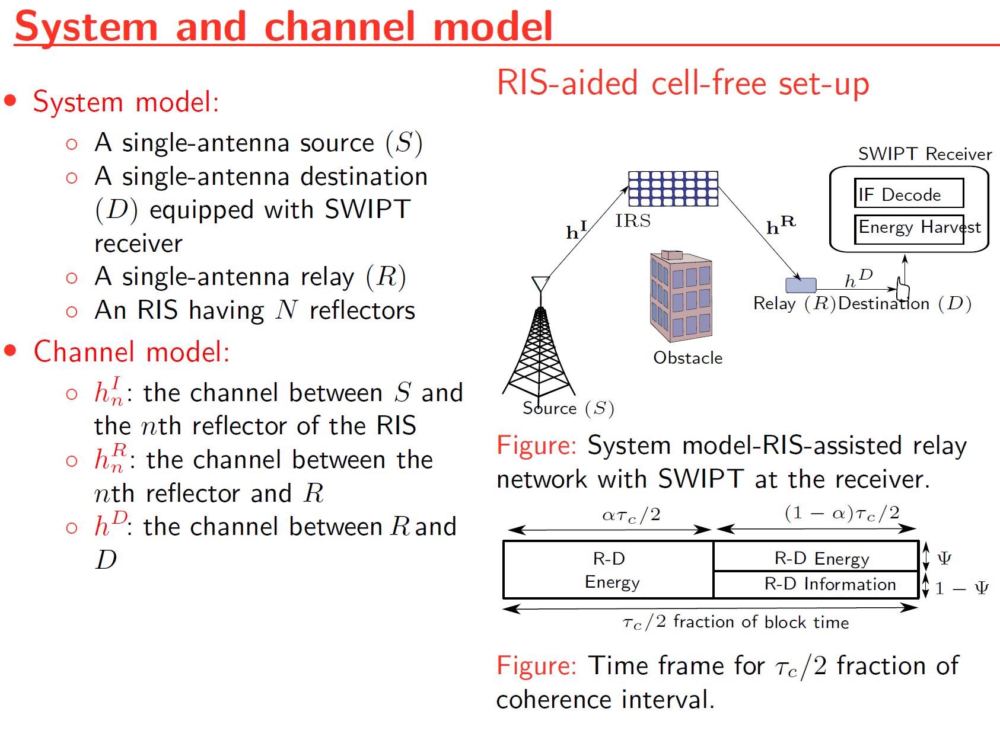
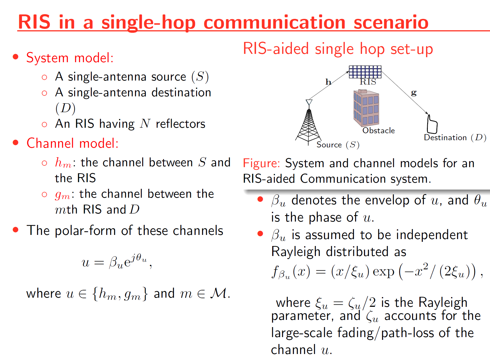

# Projects

## Energy Harvesting in RIS-Assisted Relay Networks
[ Publication ](https://www.proquest.com/docview/2744623082?pq-origsite=gscholar&fromopenview=true&sourcetype=Dissertations%20&%20Theses)

As a part of my Master's thesis the performance of simultaneous wireless information and power transfer (SWIPT) is explored for a Reflecting Reconfigurable Intelligent Surface (RIS)-assisted relay system.
Because radio-frequency (RF) signals can convey both information and energy simultaneously, there has been much research interest in designing novel technologies for simultaneous wireless information and power transmission (SWIPT) and energy harvesting (EH).
First, an RIS-assisted relay system model is proposed to improve the wireless system performance. By characterizing the optimal signal-to-noise ratio (SNR) attained through intelligent phase-shift controlling, the performance of the RIS-assisted relay system is investigated. Towards this end, tight bounds for the average achievable rate and optimal harvested energy are derived in closed-form for a hybrid SWIPT protocolThen, the performance of simultaneous wireless information and power transfer (SWIPT) is explored for the proposed RIS-assisted relay system. Also, the performance of linear EH models and non-linear EH models are compared via analytical and Monte-Carlo simulation results.

_Please view my project in **Github** for **MATLAB codes, Presentation Slides, Figures and Results**_ (Click here to open: [ _Github-Repo-link_ ](https://github.com/alandevkota/EnergyHarvesting-IRS-Relay))

_Please see my **presentation slides** here_ (Click here to open: [ _Alan_Devkota_presentation_ ](https://github.com/alandevkota/EnergyHarvesting-IRS-Relay/blob/master/Alan_Devkota_presentation.pdf))

## On the Performance of IRS-Assisted Relay Systems
[ Publication ](https://doi.org/10.1109/GLOBECOM46510.2021.9685500)

This project investigates the performance of intelligence reflective surface (IRS)-assisted relay systems. To this end, we quantify the optimal signal-to-noise ratio (SNR) attained by smartly controlling the phase-shifts of impinging electromagnetic waves upon an IRS. Thereby, a tightly approximated cumulative distribution function is derived to probabilistically characterize this optimal SNR. Then, we derive tight approximations/bounds for the achievable rate, outage probability, and average symbol error rate. Monte-Carlo simulations are used to validate our performance analysis. We present numerical results to reveal that the IRS-assisted relay system can boost the performance of end-to-end wireless transmissions.

_Please view my project in **Github** for **MATLAB codes, Presentation Slides, Figures and Results**_ (Click here to open: [ _Github-Repo-link_ ](https://github.com/alandevkota/IRS-assisted-relay-systems))

_Please see my **presentation slides** here_ (Click here to open slides: [ _presentation-slides_ ](https://github.com/alandevkota/IRS-assisted-relay-systems/blob/master/V1/IRS_relay_globecom.pdf))

_Please see my **GLOBECOM 2021 presentation video** here_ (Click here to open the conference video: [ _Alan_Devkota_presentation_ ](https://saluki-my.sharepoint.com/:v:/g/personal/alan_devkota_siu_edu/EdIBVGc_q1BHr-8UEgZLWCUBJE-DVo3qc90SJKCcQY2IEA?nav=eyJyZWZlcnJhbEluZm8iOnsicmVmZXJyYWxBcHAiOiJPbmVEcml2ZUZvckJ1c2luZXNzIiwicmVmZXJyYWxBcHBQbGF0Zm9ybSI6IldlYiIsInJlZmVycmFsTW9kZSI6InZpZXciLCJyZWZlcnJhbFZpZXciOiJNeUZpbGVzTGlua0NvcHkifX0&e=Jv29gn))

## Multispectral Object Detection using DETR with Early Fusion of Tokens

A topic we cover in this experimentation is using Detection Transformers (DETR) as a means to conduct Multispectral Object Detection. Here we are using ResNet50 to extract features of both RGB and thermal images and then provide early token fusion by concatenating the extracted features from ResNe50 together and computing attention between the tokens of RGB and IR modalities to get learned feature representations.

Our methodology leverages a dual-modality approach using both RGB and Infrared (IR) images to enhance the robustness and accuracy of object detection. Both modalities assume a distinct role which provides a more holistic understanding of the object(s) of focus. The process is subdivided into three main stages, a backbone of CNN to extract the features from both RGB and Thermal IR images, a transformer architecture that consists of an encoder and decoder to learn the contextual information between the embedded features, and two classifier units to predict class and bounding box for each object detected inside an image. Here we are using ResNet50 to extract features of both RGB and thermal images and then provide early token fusion by concatenating the extracted features from ResNe50 together and computing attention between the tokens of RGB and IR modalities to get learned feature representations. Our approach relies on transformer architectures, which are powerful tools that are typically used for language tasks. The versatility of these transformers allows us to extend behavior and comprehension of the larger-scale environment.

### Architecture

### Object Detection Results

### Evaluation Results 

_Please view my project in **Github** for **codes, Presentation Slides, Report, Figures and Results**_ (Click here to open: [ _Github-Repo-link_ ](https://github.com/alandevkota/Multispectral-Object-Detection))

_Please see my **project report** here_ ([Click here: Final Report](https://github.com/alandevkota/Multispectral-Object-Detection/blob/master/ML%20Final%20Report.pdf))

_Please see my **presentation slides** here_ ([Click here: Slides ](https://github.com/alandevkota/Multispectral-Object-Detection/blob/master/Multispectral%20Object%20Detection%20using%20DETR.pdf))

## Multimodal Object Detection Transformer with Cross-Attention across Modalities

The focus of this research is to develop a transformer model that integrates the information from different modalities together to enhance the prediction as well as address the challenges posed by missing modalities. 

### Ideas

We use the concept like retrieval from database by using query, keys, and value utilizing attention calculation in transformers. We use query (a query we wish to run on a database) from one modality and keys (the keys to search on in the database) and values (values corresponding to each key in the database) from other modalities. Cross-attention in transformer encoder is used to gain context from another modality/ input type as a method of TokenFusion in channels. This is accomplished by pairwise exchange of keys and values from different modalities. For example, to gain context from text for object detection, we simply extract the queries matrix from text modality, and keys and values matrix from the RGB and IR modalities. Moreover, self-attention blocks at the end of our model architecture would allow the model to further process the combined representations as well as enable the model to understand the dependencies between different parts of the input from different modalities.

Unlike DETR, our focus in this experiment is to develop a transformer model that integrates information from different modalities together to enhance the prediction. Our modified DETR transformer encoders extract the features from RGB and IR modality via two parallel ResNet50 backbone and harness the vast potential of heterogeneous data via channel fusion of modalities features (RGB and IR) using two parallel cross-attention encoders unlike the original DETR transformer model.

_Please view my project in **Github** for **codes**. NOTE: We will update code after completion of project_ (Click here to open: [ _Github-Repo-link_ ](https://github.com/alandevkota/Multimodal_DETR))

## N-Body Simulation with CPU and CUDA

The N-body problem is used in this project to mimic how particles move across space. The project comprises a Python-based serial implementation and a C++/Cuda-based parallel implementation. A program is generated that simulates gravitational force between n bodies in space, exploiting the massively parallel architecture provided by GPGPUs. This program generates N particle locations over a specified number of timesteps. Moreover, it produces gif plots to visualize the bodies in the simulation similar to stars in the galaxy. The results generated compare the performance of CPU-based implementation and GPU-based implementation.

### Methodology

The force on each body in the all-pairs method is the total acceleration induced by every other particle multiplied by the mass of that body. A single thread calculates forces on a single body individually. For every particle, the total of all accelerations is evaluated to calculate the velocity and new position. Each particle’s position and velocity are updated at every time step. To parallelize the code 1024 threads were selected and for each thread aceleration, position, inverse division and softening were computed via kernels. (Run nbody.py OR nbody.cu to generate data from the N-body simulation. Run simulation.py to visualize the simulation.)

### Steps to run the nbody simulation: 

First, the position of N particles is generated over a given number of timesteps and stored in an output text file for both CPU and GPU implementations. The nbody.py is the python CPU-based program that creates an output py.txt text file. N and timesteps are command line arguments illustrated in the example below:

*   python nbody.py 1000 150

The nbody.cu is the GPU-based program compiled to create an executable file called nbody. Executing nbody creates an output cu.txt text file. N and timesteps are command line arguments illustrated in the example below:

*   ./nbody 1000 150

Next, the movement of the particle positions generated from the python and Cuda programs is plotted using a simulator program written in python. This program’s input file is supplied as a command line option for both CPU and GPU implementations illustrated in the examples below:

*   python simulation.py output py.txt anim py.gif
*   python simulation.py output cu.txt anim cu.gif

Note: To create gif files for the simulation we need to install imagemagick library using ! apt install imagemagick. 

Finally, the runtime of both CPU and GPU implementations are plotted by increasing the number of bodies in powers of 2 via an evaluation program written in python. The number of iterations (times the number of bodies increases) is supplied as a command line input illustrated in the example below:

*   python evaluate.py 7

The example in the code is running the evaluation with iterations=7.

### Simulation

**N-body simulation in CPU for N = 100 and timesteps = 150**

**N-body simulation in CUDA for N = 100 and timesteps = 150**

### Runtime Comparision Results

Runtime Comparision: The runtime were plotted for both nbody.py and nbody.cu files by varying the number of bodies in power of 2 and selecting the timestep as 150

Figure below shows the runtime for N=10 (1024 bodies). We can observe that the paralleled GPU implementation required approximately 30 seconds and serialized CPU implementation required approximately 3000 seconds (50 minutes approx).

_Please view my project in **Github** for **codes, Presentation Slides, Report, Figures and Results**_ (Click here to open: [ _Github-Repo-link_ ](https://github.com/alandevkota/N-Body-Simulation-implementation-with-both-CPU-and-CUDA))

_Please see my **project report** here_ ([Click here: N Body Report](https://github.com/alandevkota/N-Body-Simulation-implementation-with-both-CPU-and-CUDA/blob/master/GPU_project_Report.pdf))

_Link to directly run the project in google colab:_ ([Click here: Gooble Colab link](https://colab.research.google.com/drive/1V8g7oCyp1UxGWFdku9eMn44U1LkSuZdf?usp=sharing))

**NOTE: _see Steps to run the nbody simulation from README file in github or follow instructions in the report_**
<!-- ------------------------------- -->

## Android-App-Remote-Controlled-Vehicular-Robotic-Arm
Remote controlled system (robot) from self developed android app that constantly performs the task of picking an object and moving it to the desired location (both automatic and manual).

In this project, a vehicular robotic arm is made and controlled by an Android mobile app. The development of this model is through ESP32 along with a mobile phone for controlling the robot. This prototype may be expected to overcome the problems of picking hazardous objects or non-hazardous objects that are far away from the user and where displacement of very heavy objects is needed from one place to another as automation is required in many industries.

### Block Diagram

### Images

### Bluetooth App Developed

_Please view my project in **Github** for **codes, Presentation Slides, Report, Figures and Results**_ (Click here to open: [ _Github-Repo-link_ ](https://github.com/alandevkota/Android-App-Remote-Controlled-Vehicular-Robotic-Arm))

_Please see my **project report** here_ ([Click here: Final Report](https://github.com/alandevkota/Android-App-Remote-Controlled-Vehicular-Robotic-Arm/blob/master/Vehicular%20Robotic%20Arm/ECE6372%20Team%20Project/doc/termProjectDesignDocument_%20ISAA.pdf))

_Please see my **presentation slides** here_ ([Click here: Slides ](https://github.com/alandevkota/Android-App-Remote-Controlled-Vehicular-Robotic-Arm/blob/master/Vehicular%20Robotic%20Arm/ECE6372%20Team%20Project/doc/termProjectPresentation_%20ISAA.pdf))

### Project Presentation video:
_This is the **presentation video link** for our project:_ ([Click here: Video](https://uofh-my.sharepoint.com/personal/adevkot2_cougarnet_uh_edu/_layouts/15/stream.aspx?id=%2Fpersonal%2Fadevkot2%5Fcougarnet%5Fuh%5Fedu%2FDocuments%2FdemoProj%5FAHD%5Fteam%5FISAA%2FFull%5Fvideo%2Emp4&ga=1))

[back to **Home**](./)